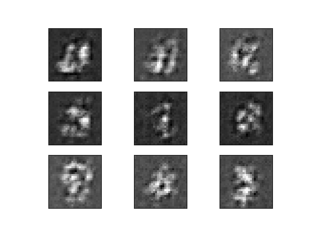
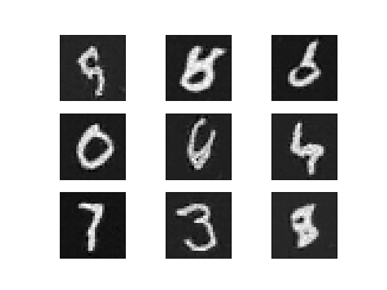
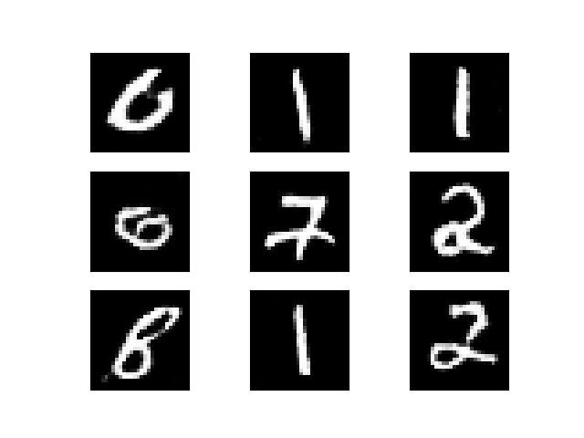
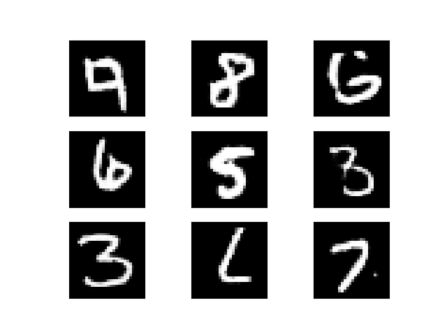

# PyTorch C++ Tutorial  
This repo follows along with the PyTorch C++ tutorial [here](https://pytorch.org/tutorials/advanced/cpp_frontend.html).  

The LibTorch distribution is needed for this tutorial. Navigate into your project directory and run the following:  

```bash  
wget https://download.pytorch.org/libtorch/cpu/libtorch-macos-1.3.1.zip  
unzip libtorch-macos-1.3.1.zip
```  

Please note that this is the distribution for MacOS with no CUDA.  

## Generative Adversarial Network (GAN)  
The program will Generative Adversarial Network (GAN) on the MNIST data set. A GAN consists of two distinct neural network models, the generator and the discriminator. The most basic definition is that a generator produces images from noise distribution to resemble images from the target distribution (i.e. the MNIST digits), and the discriminator provides a probability of how real or fake those images are. The generator uses this as feedback training input to produce more realistic images.

## Running the Program  
You can download the data set with the following command:  

```bash  
python3 download_mnist.py  
```  

The model training can be run by the following sequence of commands. You should see the epoch output in the terminal after the final command is run.  

```bash  
cd build  
cmake -DCMAKE_PREFIX_PATH=/Users/jasonadam/github/pytorch-cpp/libtorch ..  
make && ./pytorch-cpp  
```  

## Output  
The generator periodically outputs fake images. Below are images from the first to the last (120). The were produced as the generator became better at fooling the discriminator.  

*Sample 1*  
  

*Sample 40*  
  

*Sample 80*  
  

*Sample 120*  
  

We can throughout the progression of the images, that the generator has become much better at producing images that represent hand-written digits.
